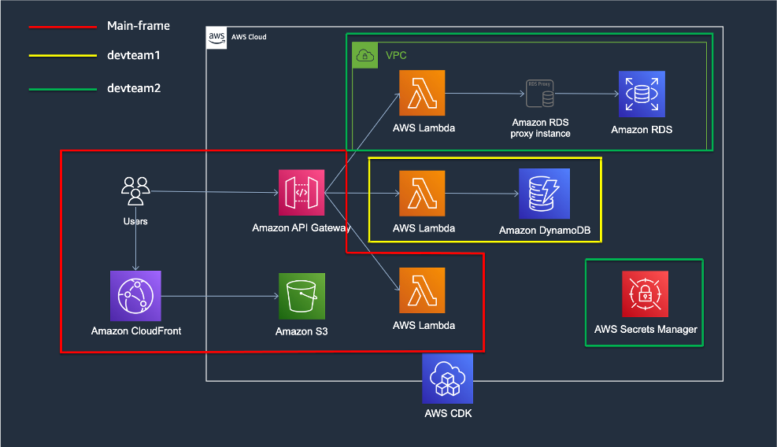
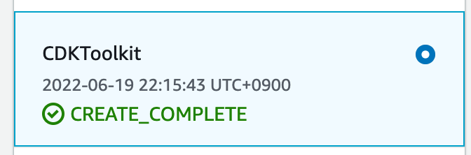
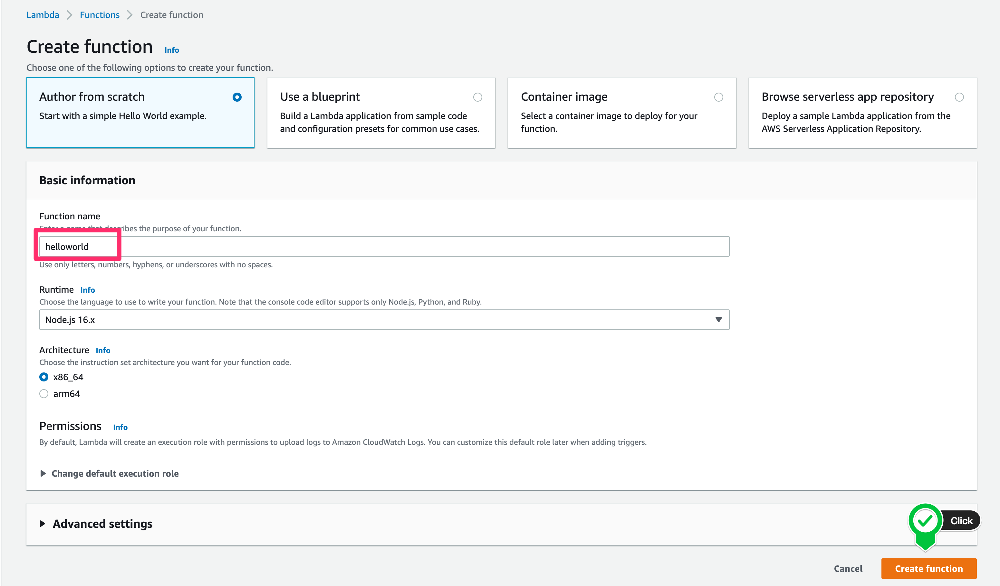
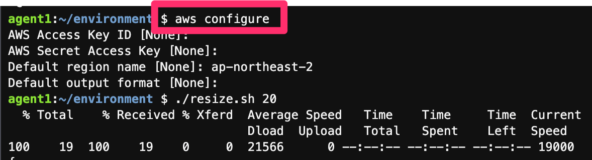
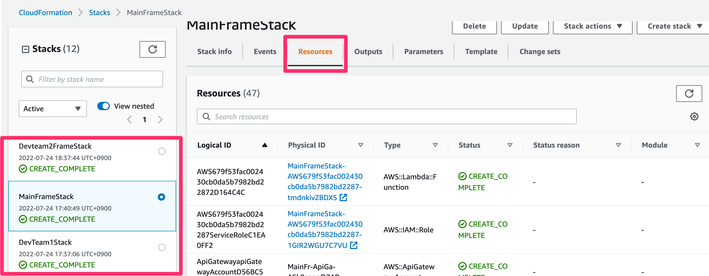
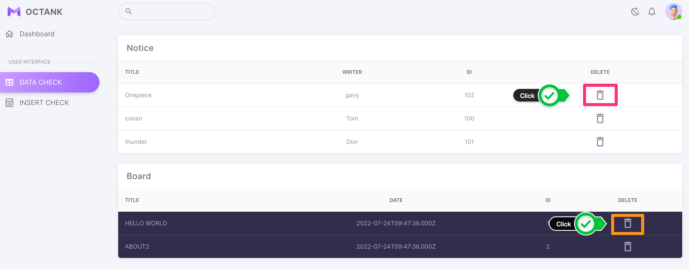
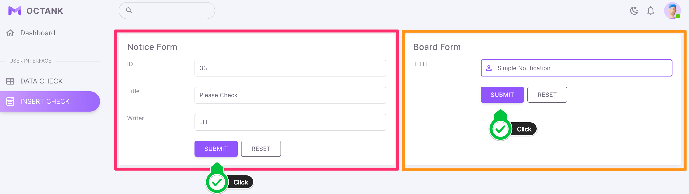
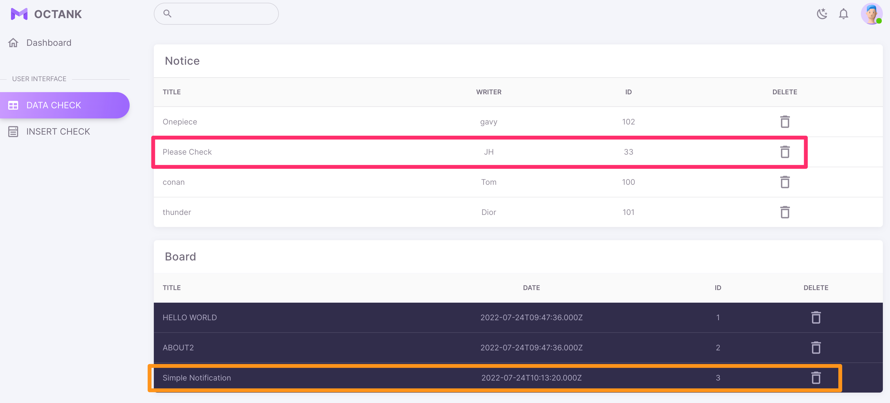
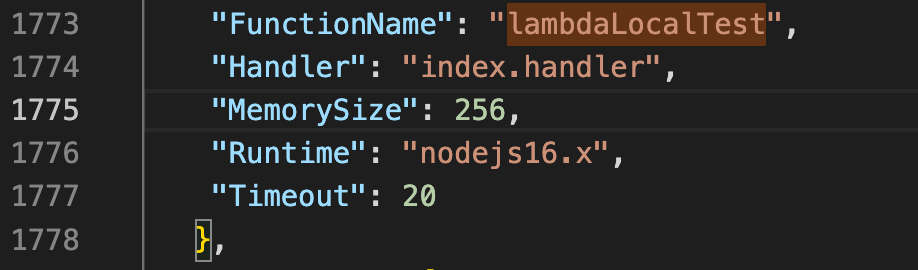
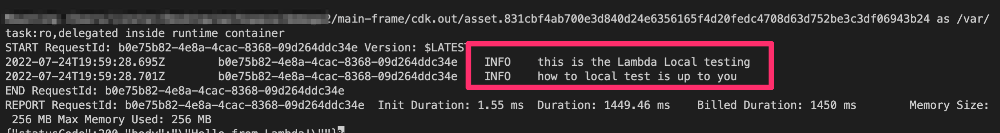

# Multi pipeline Serverless Web Application with AWS CDK

이 프로젝트를 통해서 여러분은 인프라팀, 개발팀이 별도로 관리하는 여러 개의 파이프라인을 가진 서버리스 웹 애플리케이션을 구축할 수 있습니다.
이 프로젝트를 프로비저닝 함으로써 서버리스 아키텍처가 기존의 아키텍처와 동일하게 작동하는 하는 지를 확인할 수 있고 경험할 수 있습니다.
또한 AWS CDK가 가진 장점과 활용하는 방법에 대해서 알아볼 수 있습니다.

## Table of Contents
  - [Architecture](#Architecture)
  - [Scenario (Overall summary)](#Scenario-Overall-summary)
  - [CDK Tree data structure](#CDK-Tree-data-structure)
  - [이 프로젝트를 통해 확인할 수 있는 것](#이-프로젝트를-통해-확인할-수-있는-것)
  - [Deployment time](#Deployment-time)
  - [Pre Requisite](#Pre-Requisite)
  - [Set up the Project](#Set-up-the-Project)
  - [Verify deployment](#Verify-deployment)
  - [전체 흐름과 상세 내용](#전체-흐름과-상세-내용)
  - [Used AWS Services and Pricing](#Used-AWS-Services-and-Pricing)
  - [Clean up](#Clean-up)
  - [Appendix](#Appendix)
  - [그 밖의 추가적인 기능 살펴보기](#그-밖의-추가적인-기능-살펴보기)

## Architecture

- Serverless Architecture + Provisioned RDS, RDS Proxy

## Scenario (Overall summary)
단일 서비스에 대해서 개별적으로 리소스를 관리하는 세 개의 팀이 존재합니다.
1. Amazon S3, Amazon CloudFront, Amazon API Gateway 등을 비롯한 전반적 인프라 구성을 관리하는 인프라팀.
2. 인프라팀에서 구성해둔 API Gateway에 Amazon DynamoDB와 AWS Lambda를 사용해 서버리스 아키텍처를 사용하는 개발1팀.
3. 관계형 데이터베이스가 필요한 업무로 인해 Amazon RDS와 AWS Lambda를 사용하는 개발2팀.

이러한 세 개의 팀에 맞는 멀티 파이프라인 구조에 대한 구성은 아래의 이미지와 같습니다.


## CDK Tree data structure

- 메인 프레임에는 인프팀과 개발1팀이 하나의 CDK 파이프라인 내에서 구성하는 상황을 위해 하나의 app 루트를 가지게 구성되어 있습니다. 하지만 별도로 구분되는 스택 구조를 가지고 있어서 개별로 애플리케이션을 관리할 수 있습니다.      
또한 메인 프레임 스택에는 콘솔에서 수동으로 만든 람다를 API Gateway에 붙이고 권한을 부여하는 과정이 포함되어 있습니다.
- Devteam2에는 각 팀별로 CDK 파이프라인을 관리할 수 있도록 별도의 프로젝트로 구성하였고, 메인 프레임에서 생성한 CloudFront Construct 같은 것들을 참조할 수 있게 하였습니다. Devteam2의 경우는 비록 서버리스 아키텍처가 아니지만 특정한 상황으로 인해 관계형 데이터베이스를 갖도록 RDS MySQL을 사용합니다. (작은 규모의 Micro Service라고도 볼 수 있습니다.)

#### Main Frame
- MainFrame Stack
	1. S3 + CloudFront : WebHosting, Custom Error Response for Vue.js routing
	2. API Gateway : REST API, CORS
	3. Lambda : Attatch a manually created lambda

- Devteam1 Stack (Notice)
	1. DynamoDB : Create table, insert initial datas
	2. Lambda : get, post, delete

#### Devteam2 Frame
- Devteam2 Stack (Board)
	1. RDS : RDS proxy, insert initial datas
	2. Lambda : get, post, delete

## 이 프로젝트를 통해 확인할 수 있는 것
1. 서버리스 아키텍처 경험
	- AWS의 서버리스 서비스들을 활용한 구성을 바탕으로 서버리스 구조를 알아보고 동작하는 방식을 경험함니다.
	- 이 프로젝트에서는 Vue.js를 사용하였지만 이와 비슷한 리액티브 Front End를 정적 웹 호스팅할 수 있는 방법에 대해 알 수 있습니다.
	- *비록 RDS를 프로비저닝 하지만, 이는 특수한 상황을 가정한 경우로 만약 관계형 데이터베이스도 서버리스로 구성하길 원한다면 Amazon Aurora Serverless v2를 활용할 수도 있습니다.*
2. 익숙한 개발 언어인 Typescipt 사용한 손쉬운 인프라 관리 구성
	- 평소 자주 사용하던 개발 언어를 통해 IaC 환경을 구성하는 방법을 알아볼 수 있습니다.
	- 이 프로젝트에서는 Typescript를 바탕으로 작성되었습니다.
3. CDK를 통한 Lambda 배포 용이성
	- CDK 프로젝트에 Lambda 함수를 포함하여 배포함으로써 Lambda 생성과 소스를 함께 관리할 수 있습니다.
	- 외부 모듈을 참조해야 하는 경우 CDK를 사용하지 않는 경우에는 package.json, node_modules와 같은 것들을 함께 패키징하여 .zip 등으로 업로드해야 합니다.    
하지만 CDK에서 제공하는 aws-lambda-nodejs의 경우에는 nodejs lambda에 대해 필요한 모듈 구성으로만 번들링하고 배포까지 쉽게 진행할 수 있습니다.
	- Stack이나 Construct에 대한 변경이 없고 Lambda 함수에 대한 변경만 있는 경우 `cdk deploy --hotswap`을 통해 빠르게 배포할 수 있습니다.
4. CDK 스택 혹은 기존 리소스 간 연계 용이성
	- 이미 만들어진 리소스 혹은 다른 파이프라인 Stack에서 만든 리소스를 참조하고 해당 리소스에 추가로 연결 구성 가능합니다.
5. 인프라 구성 관리, 애플리케이션 서비스 구성 관리에 대한 파이프라인 분리
	- 각 조직의 규모와 특성에 따라 CDK를 활용한 파이프라인 구성을 참조하거나 응용하여 파이프라인 관리에 대한 인사이트를 얻을 수 있습니다.

## Deployment time
- Main-Frame : ~ 10 min.
- Devteam2-Frame : ~ 15min. 

## Pre Requisite
1. [AWS 계정 생성 및 사용자 생성](https://aws.amazon.com/ko/resources/create-account/)
	- <span style="color: red">CDK가 동작하기 위해서는 CDK에서 포함하고 있는 서비스에 대한 권한을 사용자가 가지고 있어야 합니다. 하지만 수행의 편의성을 위해 administrator 권한을 부여할 수 있으나 운영 환경에서는 지양해야 합니다.</span>
2. [전반적 설치 과정](https://aws.amazon.com/ko/getting-started/guides/setup-cdk/) - 상세 과정 및 방법 소개
	- local or AWS Cloud9, CLI, node, CDK Bootstrap에 관한 자세한 내용이 포함되어 있음
	- AWS Cloud9을 사용하는 경우 하기의 기본적인 설치 과정을 건너뛰고 빠르게 시작할 수 있습니다. (Cloud9 인스턴스가 소유한 Role에 위 1번에서 언급한 정책 부여 필요 - ex. Administrator policy)
3. AWS CLI - Version : aws-cli/2.7.14 Python/3.9.11 Darwin/20.6.0 exe/x86_64 prompt/off
4. node : v16.16
5. cdk 2.33.0 (build 859272d) or cdk 2.0 ~
6. Docker Install
7. CDK Bootstrap  
    ```shell
	$ ## Check account information
	$ aws sts get-caller-identity

	$ ## 위에서 나온 값 중 "Account" 뒤의 숫자가 아래의 ACCOUNT-NUMBER
	$ ## Region은 ap-northeast-2 입력
	$ cdk bootstrap aws://ACCOUNT-NUMBER/REGION
	```

	- 만약 CDK Toolkit이 Cloudformation에 보이지 않는 경우 프로젝트를 정상적으로 실행할 수 없으니 확인이 필요합니다.
8. [SAM Install](https://docs.aws.amazon.com/ko_kr/serverless-application-model/latest/developerguide/serverless-sam-cli-install-mac.html)
9. Lambda 생성
	- <span style="color: red">매뉴얼로 만든 'helloworld' 이름을 가진 Lambda를 CDK Stack에서 참조하고 이를 API Gateway에 연결합니다.</span>



## Set up the Project
- devteam2-frame을 시작하기 전에 main-frame이 먼저 완료되어야 합니다.
- AWS Cloud9을 사용하는 경우 꼭 EBS 볼륨 용량을 늘려줘야 합니다. (기본 10GB이므로 20GB로 늘려줍니다. 아래 단계 과정 중 안내에 따라 진행)  

```shell
$ git clone https://github.com/aws-samples/multi-pipeline-serverless-web-application-with-cdk
$ cd multi-pipeline-serverless-web-application-with-cdk
$ 
$ # If you are using Cloud9 Do this
$ chmod +x resize.sh
$ ./resize.sh 20
$ 
$ cd main-frame
$ npm install
$ cdk deploy --all --outputs-file ./cdk-outputs.json # type y if ask soemthing, takes about 10 min.
$ # If there is error, please check belows
$ # 1. cdk bootstrap aws://ACCOUNT-NUMBER/REGION
$ # 2. Did you make lambda name with 'helloword'
$ 
$ # wait to complete main-frame
$ cd ../devteam2-frame
$ npm install
$ cdk deploy --all --outputs-file ./cdk-outputs.json # type y if ask soemthing, takes about 10~15 min.
```

## Verify deployment
1. CDK에서 생성된 리소스 확인  

2. CloudFormation > MainFrameStack > CFDomainName link  

3. S3 + CloudFront를 통해 호스팅되는 웹 페이지 접속 확인  

4. API Gateway를 통해 DynamoDB와 RDS MySQL로부터 조회되는 데이터 확인

5. 데이터 삭제  

6. 데이터 적재  

7. 적재 데이터 확인  


## 전체 흐름과 상세 내용
1. CDK Deploy
2. S3 + CloudFront
	- 프로젝트 내에 빌드된 정적 객체들 포함
	- S3에 업로드되는 정적 객체들은 Vue.js를 통해 개발되고 빌드된 객체
	- CORS 설정 및 SPA Front End를 위한 라우팅 설정
3. API Gateway
	- 리소스 생성, 메소드 생성 및 기존 생성된 Lambda 연결 (Lambda 이름을 통한 주입)
	- Response에 대한 CORS 설정
	- DynamoDB를 사용하는 개발1팀의 Lambda 연결 (GET, POST, DELETE)
	- RDS MySQL을 사용하는 개발2팀의 Lambda 연결 (GET, POST, DELETE)
		- API Gateway 연결 시 같은 파이프라인 내에서 생성되지 않았으나, CfnOutput을 통해 생성된 정보 값을 통해 개발2팀의 프로젝트에서도 이를 참조하고 사용
4. AWS Lambda
	- API Gateway에 Proxy Integration되며 Back End 역할 수행. Request를 DB에 전달하고 다시 Reponse로 전달
	- Frnt End에서 필요한 API Gateway URL 정보값을 S3 웹호스팅 경로에 생성
	- DynamoDB 생성 후 초기 기본 데이터를 DynamoDB에 생성
	- RDS MySQL 생성 후 초기 기본 데이터를 MySQL에 생성
5. Amazon DynamoDB
	- RCU, WCU 5에 해당되는 DynamoDB
	- Partition Key: id, Sort Key: title
	- DynamoDB 생성 후 Lambda가 세 건의 데이터 생성
6. Amazon RDS
	- T3, Large 인스턴스. 단일 AZ
	- 순차적으로 증가하는 id를 Primary Key로 가지며 title, date 컬럼 존재
	- RDS 생성 후 Lambda가 세 건의 데이터 생성
7. Amazon RDS Proxy
	- Lambda에서 프로비저닝된 RDS에 직접 연결을 구성하게 될 경우 DB connection 소모량이 많아 문제가 될 수 있으므로 이를 처리할 수 있게 하기 위한 RDS PRoxy 생성
	- Lambda가 RDS Proxy Endpoint를 통해 데이터 쿼리
8. AWS Secrets Manager
	- DB 이름, 비밀번호 등 RDS 연결에 필요한 정보를 Secrets Manager에 등록해두고 API 호출하여 사용함으로써 소스 코드 내에 하드 코딩으로 인한 보안 취약성 제거
9. **AWS에서 서비스 연결 구성 시 공통적으로 다른 서비스에 대한 사용 권한을 소유해야 하지만, 이러한 과정들을 CDK에서 제공하는 기능 호출을 통해 비교적 쉽게 구성 가능**

## Used AWS Services and Pricing
1. [Amazon S3](https://aws.amazon.com/ko/s3/pricing/)
2. [Amazon CloudFront](https://aws.amazon.com/ko/cloudfront/pricing/)
3. [Amazon API Gateway](https://aws.amazon.com/ko/api-gateway/pricing/)
4. [AWS Lambda](https://aws.amazon.com/ko/lambda/pricing/)
5. [Amazon DynamoDB](https://aws.amazon.com/ko/dynamodb/pricing/)
6. [Amazon RDS](https://aws.amazon.com/ko/rds/pricing/)
7. [Amazon RDS Proxy](https://aws.amazon.com/ko/rds/proxy/pricing/)
8. [AWS Secrets Manager](https://aws.amazon.com/ko/secrets-manager/pricing/)

## Clean up
```shell
$ cd devteam2-frame
$ cdk destroy --all # it takes about 10~15 min.
$ cd ../main-frame
$ cdk destroy --all # it takes about ~10 min.
```
- <span style="color: red">모든 리소스를 정리한 후 CloudFormation에 존재하는 `CDKToolkit`도 꼭 함께 정리해야 합니다. 정리하지 않은 경우 KMS를 사용하기 때문에 월 1$의 비용이 청구될 수 있습니다.</span>
- Cloud9을 사용한 경우 Cloud9에 대해서도 모두 종료합니다.

----
## Appendix
### Lambda Hotswap, SAM Lambda Test, CDK Pipeline
#### CDK Hotswap
- Hotswap은 프로젝트 내에 lambda 소스에 대한 변경만 있는 경우 전체 Stack을 배포하지 않고 Lambda에 대한 변경 분만 배포를 진행합니다. 이를 사용하여 Lambda 배포 시간을 단축할 수 있습니다.    
(하지만 Stack에 변경된 내용은 없으므로 Stack에 대한 변경/재배포가 반영되지는 않습니다.)
- 아래와 같은 순서로 이 기능을 테스트해볼 수 있습니다.

1. main-frame/lambda/notices/getOne/index.js 13번 줄에 `console.log('hotswap test);` 추가 후 저장
```javascript
const AWS = require('aws-sdk');
const ddb = new AWS.DynamoDB.DocumentClient();

const headers = {
    "Content-Type": "application/json",
    "Access-Control-Allow-Origin": "*",
    "Access-Control-Allow-Headers": "Content-Type,Authorization,access-token"
};

exports.handler = async (event, context) => {
    const itemId = event.pathParameters.id;
    const titleParam = typeof event.body == 'object' ? event.body : JSON.parse(event.body);
    console.log('hotswap test');	// add here for test
    
```

2. 배포 과정 및 시간 확인 - Lambda Function Stack update 수행
```shell
$ cd main-frame
$ cdk deploy --all --outputs-file ./cdk-outputs.json
```

3. main-frame/lambda/notices/getOne/index.js 13번 줄에 추가한 `console.log('hotswap test);` 제거 후 저장
```shell
$ cdk deploy --hotswap --all --outputs-file ./cdk-outputs.json
```

4. Lambda Stack과 관련한 대한 배포가 진행되지 않고 빠른 속도로 Lambda가 배포되는 것을 볼 수 있습니다.

#### SAM Lambda Local Test
- Local Test를 위해 사용할 Lambda를 준비해두었으며 경로는 다음과 같습니다   
main-frame/lambda/lambdaLocalTest/index.js  : Lambda 함수 코드   
main-frame/lib/app-construct/lambdaLocalTest.ts : Lambda를 생성하기 위한 Construct, main-frame에서 선언 및 호출됨.   
```javascript
exports.handler = async (event) => {
    console.log('this is the Lambda Local testing');
    console.log('how to local test is up to you');
    
    const response = {
        statusCode: 200,
        body: JSON.stringify('Hello from Lambda!'),
    };
    return response;
};
```

1. 다음의 경로를 따라 Main-Frame 디렉터리로 이동
```shell
$ cd main-frame
$ cdk synth --all # this makes cfn template through cdk source code
$ # after then under the cdk.out, You can find templates.
```

2. main-frame/cdk.out/MainFrameStack.template.json을 열어보면 `LambdaLocalTest`가 생성된 것을 확인 가능.   


3. 이 정보를 바탕으로 Lambda를 Deploy하지 않고 Local에서 실행 (Docker 기반)
```shell
$ cd main-frame
$ # sam local invoke [OPTIONS] [STACK_NAME/FUNCTION_IDENTIFIER]
$ sam local invoke -t ./cdk.out/MainFrameStack.template.json lambdaLocalTest
```
   


4. 이 처럼 SAM을 통해 local에서 수행 가능한 기능과 옵션들이 여럿 제공되고 있으며 이 페이지 가장 아래쪽에 관련된 명령어가 나열되어 있습니다.   


## 그 밖의 추가적인 기능 살펴보기
1. AWS CDK Workshop
	- [Local API Gateway](https://docs.aws.amazon.com/ko_kr/serverless-application-model/latest/developerguide/serverless-sam-cli-using-start-api.html)
2. DynamoDB Local
	- [Install DynamoDB on local](https://docs.aws.amazon.com/ko_kr/amazondynamodb/latest/developerguide/DynamoDBLocal.html)
3. CDK Pipeline
	- [CDK Pipeline Workshop](https://cdkworkshop.com/20-typescript/70-advanced-topics/200-pipelines.html)

 

### Lambda Local Test - SAM
* `cdk synth --no-staging > tamplate.yml`

### Invoke the function FUNCTION_IDENTIFIER declared in the stack STACK_NAME
* `sam local invoke [OPTIONS] [STACK_NAME/FUNCTION_IDENTIFIER]`

### Start all APIs declared in the AWS CDK application
* `sam local start-api -t ./cdk.out/CdkSamExampleStack.template.json [OPTIONS]`

### Start a local endpoint that emulates AWS Lambda
* `sam local start-lambda -t ./cdk.out/CdkSamExampleStack.template.json [OPTIONS]`

### example
* `sam local invoke -t ./cdk.out/Devteam2FrameStack.template.json boardGet`


### Useful commands - CDK

* `npm run build`   compile typescript to js
* `npm run watch`   watch for changes and compile
* `npm run test`    perform the jest unit tests
* `cdk deploy`      deploy this stack to your default AWS account/region
* `cdk diff`        compare deployed stack with current state
* `cdk synth`       emits the synthesized CloudFormation template
* `cdk deploy --all --outputs-file ./cdk-outputs.json`  deploy whole stack within a project
* `cdk deploy --hotswap`    quickly deploy lambda