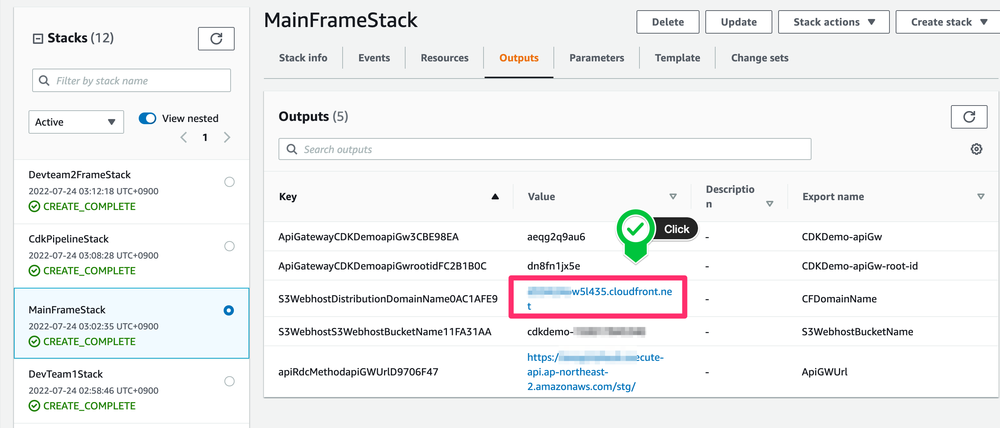

# Multi pipeline Serverless Web Application with AWS CDK
This project allows you to build a serverless web application with multiple pipelines managed separately by your infrastructure and development teams.
By provisioning this project, you can see and experience whether a serverless architecture will behave the same as a traditional architecture.
You can also learn about the benefits of the [AWS CDK](https://aws.amazon.com/ko/cdk/) and how to use it.

## Table of Contents
  - [Architecture](#Architecture)
  - [Scenario (Overall summary)](#Scenario-Overall-summary)
  - [CDK Tree data structure](#CDK-Tree-data-structure)
  - [What you can see through this project](#What-you-can-see-through-this-project)
  - [Deployment time](#Deployment-time)
  - [Pre Requisite](#Pre-Requisite)
  - [Set up the Project](#Set-up-the-Project)
  - [Verify deployment](#Verify-deployment)
  - [Full flow and details](#Full-flow-and-details)
  - [Used AWS Services and Pricing](#Used-AWS-Services-and-Pricing)
  - [Clean up](#Clean-up)
  - [Appendix](#Appendix)
  - [Explore other additional features](#Explore-other-additional-features)

## Architecture

- Serverless Architecture + Provisioned RDS, RDS Proxy

## Scenario (Overall summary)
There are three teams managing resources individually for a single service.
1. Infrastructure team managing overall infrastructure configuration including Amazon S3, Amazon CloudFront, Amazon API Gateway, etc.
2. Development team 1 using a serverless architecture using Amazon DynamoDB and AWS Lambda for API Gateway configured by the infrastructure team.
3. Development2 team using Amazon RDS and AWS Lambda for work that requires a relational database.

The configuration for a multi-pipeline structure for these three teams is shown in the image below.


## CDK Tree data structure

- The main frame is configured to have one app root for the situation where the infrastructure team and the development 1 team are configured within one CDK pipeline. However, since it has a separate stack structure, applications can be managed individually.     
The mainframe stack also includes the process of attaching a manually created lambda to API Gateway from the console and granting permissions.
- Devteam2 is configured as a separate project so that each team can manage the CDK pipeline, and can refer to things like CloudFront Construct created in the mainframe. In the case of Devteam2, although it is not a serverless architecture, it uses RDS MySQL to have a relational database due to certain circumstances.

#### Main Frame
- MainFrame Stack
	1. S3 + CloudFront : WebHosting, Custom Error Response for Vue.js routing
	2. API Gateway : REST API, CORS
	3. Lambda : Attatch a manually created lambda

- Devteam1 Stack (Notice)
	1. DynamoDB : Create table, insert initial datas
	2. Lambda : get, post, delete

#### Devteam2 Frame
- Devteam2 Stack (Board)
	1. RDS : RDS proxy, insert initial datas
	2. Lambda : get, post, delete

## What you can see through this project
1. Serverless architecture experience
	- Based on the configuration using AWS's serverless services, learn about the serverless structure and experience how it works.
	- I used Vue.js for this project, but you can see how you can static web host a reactive front end similar to this.
	- *Although we do provision RDS, this is for special circumstances. If you want your relational database to be serverless as well, you can also take advantage of Amazon Aurora Serverless v2.*
2. Easy infrastructure management configuration using the familiar development language Typescipt
	- You can learn how to configure the IaC environment through the development language you use frequently.
	- This project was written based on Typescript.
3. Ease of deploying Lambda via CDK
	- By including a Lambda function and deploying it in a CDK project, you can manage Lambda creation and source together.
	- If you need to reference external modules, if you are not using CDK, you need to package things like package.json and node_modules together and upload them as .zip, etc.   
`However, in the case of aws-lambda-nodejs provided by the CDK, you can bundle only with the module configuration required for nodejs lambda and proceed with deployment easily.`
	- If there are no changes to the Stack or Construct, and only changes to the Lambda function, you can quickly deploy with `cdk deploy --hotswap`.
4. Easy linkage between CDK stacks or existing resources
	- You can refer to already created resources or resources created in other pipeline stacks and configure additional connections to those resources.
5. Separation of pipelines for infrastructure configuration management, application service configuration management
	- Depending on the size and characteristics of each organization, you can refer to or apply the pipeline configuration using CDK to gain insight into pipeline management.

## Deployment time
- Main-Frame : ~ 10 min.
- Devteam2-Frame : ~ 15min. 

## Pre Requisite
1. [Create AWS Account and Create User](https://aws.amazon.com/en/resources/create-account/)
	- <span style="color: red">In order for the CDK to work, the user must have permission for the services included in the CDK. However, you can grant administrator privileges for convenience, but it should be avoided in the operating environment.</span>
2. [Overall installation process](https://aws.amazon.com/en/getting-started/guides/setup-cdk/) 	- Introduction of detailed process and method
	- Contains detailed information about local or AWS Cloud9, CLI, node, CDK Bootstrap
	- If you are using AWS Cloud9, you can skip the basic installation process below and get started quickly. (Requires granting the policy mentioned in step 1 above to the role owned by the Cloud9 instance - ex. Administrator policy)
3. AWS CLI - Version : aws-cli/2.7.14 Python/3.9.11 Darwin/20.6.0 exe/x86_64 prompt/off
4. node: v16.16
5. cdk 2.33.0 (build 859272d) or cdk 2.0 ~
6. Docker Install
7. CDK Bootstrap  
    ```shell
	$ ## Check account information
	$ aws sts get-caller-identity

	$ ## The number after "Account" of the above values is ACCOUNT-NUMBER
	$ ## Region : ap-northeast-2
	$ cdk bootstrap aws://ACCOUNT-NUMBER/REGION
	```

	- If the CDK Toolkit is not visible in Cloudformation, the project cannot be run normally, so you need to check it.
8. [SAM Install](https://docs.aws.amazon.com/en_us/serverless-application-model/latest/developerguide/serverless-sam-cli-install-mac.html)
9. Create Lambda
	- <span style="color: red">Reference the manually created Lambda with the name 'helloworld' in the CDK Stack and connect it to API Gateway.</span>


## Set up the Project
- Main-frame must be completed first before starting devteam2-frame.
- When using AWS Cloud9, you must increase the EBS volume capacity. (The default is 10GB, so increase it to 20GB. Follow the instructions during the steps below)  

```shell
$ git clone https://github.com/aws-samples/multi-pipeline-serverless-web-application-with-cdk
$ cd multi-pipeline-serverless-web-application-with-cdk
$ 
$ # If you are using Cloud9 Do this
$ chmod +x resize.sh
$ ./resize.sh 20
$ 
$ cd main-frame
$ npm install
$ cdk deploy --all --outputs-file ./cdk-outputs.json # type y if ask soemthing, takes about 10 min.
$ # If there is error, please check belows
$ # 1. cdk bootstrap aws://ACCOUNT-NUMBER/REGION
$ # 2. Did you make lambda name with 'helloword'
$ 
$ # wait to complete main-frame
$ cd ../devteam2-frame
$ npm install
$ cdk deploy --all --outputs-file ./cdk-outputs.json # type y if ask soemthing, takes about 10~15 min.
```

## Verify deployment
1. Check the resources created by the CDK  

2. CloudFormation > MainFrameStack > CFDomainName link  

3. Verify access to web pages hosted via S3 + CloudFront  

4. Check data retrieved from DynamoDB and RDS MySQL through API Gateway  

5. Delete data  

6. Load data  

7. Check Load data  


## Full flow and details
1. CDK Deploy
2. S3 + CloudFront
	- Include static objects built into the project
	- Static objects uploaded to S3 are objects developed and built through Vue.js
	- CORS setting and routing setting for SPA Front End
3. API Gateway
	- Create a resource, create a method, and connect an existing created Lambda (injection via Lambda name)
	- CORS setting for Response
	- Lambda connection of devTeam1 using DynamoDB (GET, POST, DELETE)
	- Lambda connection of DevTeam2 using RDS MySQL (GET, POST, DELETE)
	- Although not created within the same pipeline when API Gateway is connected, it is also referenced and used in the development team's project through the information value generated through CfnOutput.
4. AWS Lambda
	- Proxy Integration to API Gateway and performs the role of Back End. Pass the request to the DB and pass it back to the response
	- Create API Gateway URL information value required at Frnt End in S3 web hosting path
	- After DynamoDB is created, initial basic data is created in DynamoDB
	- After RDS MySQL is created, initial basic data is created in MySQL
5. Amazon DynamoDB
	- DynamoDB for RCU, WCU 5
	- Partition Key: id, Sort Key: title
	- After creating DynamoDB, Lambda creates three data sets
6. Amazon RDS
	- T3, Large instances. single AZ
	- It has sequentially increasing id as the primary key, and title and date columns exist.
	- After RDS creation, Lambda generates three data sets
7. Amazon RDS Proxy
	- If you configure a direct connection to the RDS provisioned by Lambda, it can be a problem because of the high DB connection consumption, so create an RDS proxy to handle this.
	- Lambda queries data through RDS Proxy Endpoint
8. AWS Secrets Manager
	- Removal of security vulnerabilities due to hard coding in source code by registering information necessary for RDS connection such as DB name and password in Secrets Manager and using API calls
9. **When configuring service connection in AWS, it is necessary to have permission to use other services in common, but these processes can be configured relatively easily through function calls provided by the CDK**

## Used AWS Services and Pricing
1. [Amazon S3](https://aws.amazon.com/ko/s3/pricing/)
2. [Amazon CloudFront](https://aws.amazon.com/ko/cloudfront/pricing/)
3. [Amazon API Gateway](https://aws.amazon.com/ko/api-gateway/pricing/)
4. [AWS Lambda](https://aws.amazon.com/ko/lambda/pricing/)
5. [Amazon DynamoDB](https://aws.amazon.com/ko/dynamodb/pricing/)
6. [Amazon RDS](https://aws.amazon.com/ko/rds/pricing/)
7. [Amazon RDS Proxy](https://aws.amazon.com/ko/rds/proxy/pricing/)
8. [AWS Secrets Manager](https://aws.amazon.com/ko/secrets-manager/pricing/)

## Clean up
```shell
$ cd devteam2-frame
$ cdk destroy --all # it takes about 10~15 min.
$ cd ../main-frame
$ cdk destroy --all # it takes about ~10 min.
```
- <span style="color: red">After cleaning all the resources, you must also clean up the `CDKToolkit` that exists in CloudFormation. If you don't, you may be charged $1/month because you use KMS.</span>
- If you used Cloud9, shut it all down for Cloud9 as well.

----
## Appendix
### Lambda Hotswap, SAM Lambda Test, CDK Pipeline
#### CDK Hotswap
- Hotswap does not deploy the entire stack if there is only a change to the lambda source within the project, but only the change to the Lambda. You can use this to speed up your Lambda deployment time.     
(However, there are no changes to the Stack, so changes/redistributions to the Stack are not reflected.)
- You can test this function in the following order.

1. Add `console.log('hotswap test);` to main-frame/lambda/notices/getOne/index.js line 13 and save
```javascript
const AWS = require('aws-sdk');
const ddb = new AWS.DynamoDB.DocumentClient();

const headers = {
    "Content-Type": "application/json",
    "Access-Control-Allow-Origin": "*",
    "Access-Control-Allow-Headers": "Content-Type,Authorization,access-token"
};

exports.handler = async (event, context) => {
    const itemId = event.pathParameters.id;
    const titleParam = typeof event.body == 'object' ? event.body : JSON.parse(event.body);
    console.log('hotswap test');	// add here for test
    
```

2. Check the deployment process and time - Perform Lambda Function Stack update
```shell
$ cd main-frame
$ cdk deploy --all --outputs-file ./cdk-outputs.json
```

3. main-frame/lambda/notices/getOne/index.js Remove and save `console.log('hotswap test);` added to line 13
```shell
$ cdk deploy --hotswap --all --outputs-file ./cdk-outputs.json
```

4. You can see that Lambda is deployed at a fast pace without deployment related to Lambda Stack.


#### SAM Lambda Local Test
- Lambda to be used for local test is prepared and the path is as follows   
main-frame/lambda/lambdaLocalTest/index.js  : Lambda function code   
main-frame/lib/app-construct/lambdaLocalTest.ts : Construct for creating Lambda, declared and called in main-frame.   
```javascript
exports.handler = async (event) => {
    console.log('this is the Lambda Local testing');
    console.log('how to local test is up to you');
    
    const response = {
        statusCode: 200,
        body: JSON.stringify('Hello from Lambda!'),
    };
    return response;
};
```

1. Move to the Main-Frame directory by following the path
```shell
$ cd main-frame
$ cdk synth --all # this makes cfn template through cdk source code
$ # after then under the cdk.out, You can find templates.
```

2. If you open main-frame/cdk.out/MainFrameStack.template.json, you can see that `LambdaLocalTest` has been created.   


3. Based on this information, Lambda is not deployed and run locally (Docker-based)
```shell
$ cd main-frame
$ # sam local invoke [OPTIONS] [STACK_NAME/FUNCTION_IDENTIFIER]
$ sam local invoke -t ./cdk.out/MainFrameStack.template.json lambdaLocalTest
```
   


4. As such, several functions and options that can be performed locally are provided through SAM, and related commands are listed at the bottom of this page.   


## Explore other additional features
1. AWS CDK Workshop
	- [Local API Gateway](https://docs.aws.amazon.com/serverless-application-model/latest/developerguide/serverless-sam-cli-using-start-api.html)
2. DynamoDB Local
	- [Install DynamoDB on local](https://docs.aws.amazon.com/ko_kr/amazondynamodb/latest/developerguide/DynamoDBLocal.html)


### Lambda Local Test - SAM
* `cdk synth --no-staging > tamplate.yml`

### Invoke the function FUNCTION_IDENTIFIER declared in the stack STACK_NAME
* `sam local invoke [OPTIONS] [STACK_NAME/FUNCTION_IDENTIFIER]`

### Start all APIs declared in the AWS CDK application
* `sam local start-api -t ./cdk.out/CdkSamExampleStack.template.json [OPTIONS]`

### Start a local endpoint that emulates AWS Lambda
* `sam local start-lambda -t ./cdk.out/CdkSamExampleStack.template.json [OPTIONS]`

### example
* `sam local invoke -t ./cdk.out/Devteam2FrameStack.template.json boardGet`


## Useful commands - CDK

* `npm run build`   compile typescript to js
* `npm run watch`   watch for changes and compile
* `npm run test`    perform the jest unit tests
* `cdk deploy`      deploy this stack to your default AWS account/region
* `cdk diff`        compare deployed stack with current state
* `cdk synth`       emits the synthesized CloudFormation template
* `cdk deploy --all --outputs-file ./cdk-outputs.json`  deploy whole stack within a project
* `cdk deploy --hotswap`    quickly deploy lambda

## Security

See [CONTRIBUTING](CONTRIBUTING.md#security-issue-notifications) for more information.

## License

This library is licensed under the MIT-0 License. See the LICENSE file.

