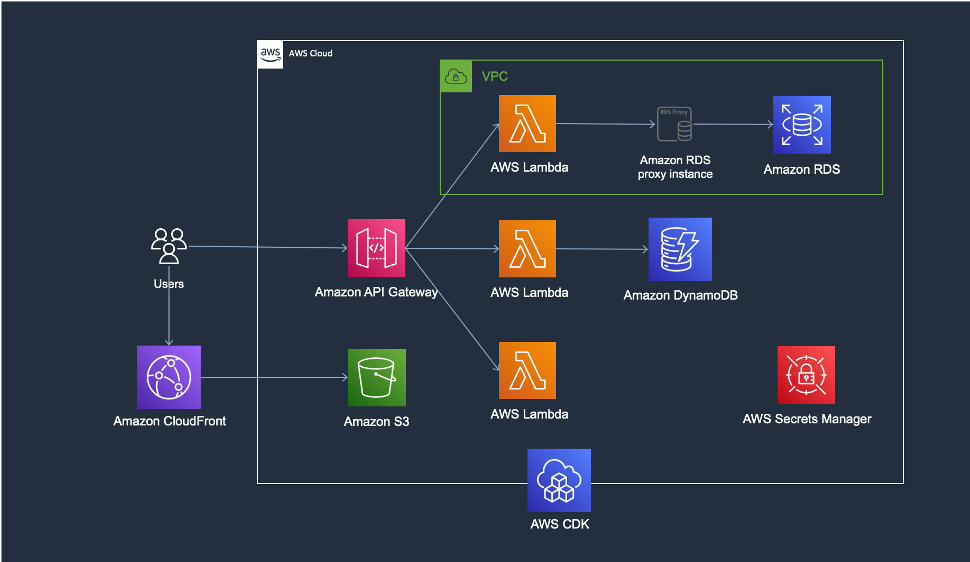

# Multi pipeline Serverless Web Application with AWS CDK

이 프로젝트를 통해서 여러분은 인프라팀, 개발팀이 별도로 관리하는 여러 개의 파이프라인을 가진 서버리스 웹 애플리케이션을 구축할 수 있습니다.
이 프로젝트를 프로비저닝 함으로써 서버리스 아키텍처가 기존의 아키텍처와 동일하게 작동하는 하는 지를 확인할 수 있고 경험할 수 있습니다.
또한 AWS CDK가 가진 장점과 활용하는 방법에 대해서 알아볼 수 있습니다.

## Architecture

- Serverless Architecture + Provisioned RDS, RDS Proxy

## Scenario (Overall summary)
단일 서비스에 대해서 개별적으로 리소스를 관리하는 세 개의 팀이 존재합니다.
1. Amazon S3, Amazon CloudFront, Amazon API Gateway 등을 비롯한 전반적 인프라 구성을 관리하는 인프라팀.
2. 인프라팀에서 구성해둔 API Gateway에 Amazon DynamoDB와 AWS Lambda를 사용해 서버리스 아키텍처를 사용하는 개발1팀.
3. 관계형 데이터베이스가 필요한 업무로 인해 Amazon RDS와 AWS Lambda를 사용하는 개발2팀.

이러한 세 개의 팀에 맞는 멀티 파이프라인 구조에 대한 구성은 아래의 이미지와 같습니다.


## CDK Tree data structure

- 메인 프레임에는 인프팀과 개발1팀이 하나의 CDK 파이프라인 내에서 구성하는 상황을 위해 하나의 app 루트를 가지게 구성되어 있습니다. 하지만 별도로 구분되는 스택 구조를 가지고 있어서 개별로 애플리케이션을 관리할 수 있습니다.      
또한 메인 프레임 스택에는 콘솔에서 수동으로 만든 람다를 API Gateway에 붙이고 권한을 부여하는 과정이 포함되어 있습니다.
- Devteam2에는 각 팀별로 CDK 파이프라인을 관리할 수 있도록 별도의 프로젝트로 구성하였고, 메인 프레임에서 생성한 CloudFront Construct 같은 것들을 참조할 수 있게 하였습니다. Devteam2의 경우는 비록 서버리스 아키텍처가 아니지만 특정한 상황으로 인해 관계형 데이터베이스를 갖도록 RDS MySQL을 사용합니다. (작은 규모의 Micro Service라고도 볼 수 있습니다.)

#### Main Frame
- MainFrame Stack
	1. S3 + CloudFront : WebHosting, Custom Error Response for Vue.js routing
	2. API Gateway : REST API, CORS
	3. Lambda : Attatch a manually created lambda

- Devteam1 Stack (Notice)
	1. DynamoDB : Create table, insert initial datas
	2. Lambda : get, post, delete

#### Devteam2 Frame
- Devteam2 Stack (Board)
	1. RDS : RDS proxy, insert initial datas
	2. Lambda : get, post, delete

## 이 프로젝트를 통해 확인할 수 있는 것.
1. 서버리스 아키텍처 경험
	- AWS의 서버리스 서비스들을 활용한 구성을 바탕으로 서버리스 구조를 알아보고 동작하는 방식을 경험함니다.
	- 이 프로젝트에서는 Vue.js를 사용하였지만 이와 비슷한 리액티브 Front End를 정적 웹 호스팅할 수 있는 방법에 대해 알 수 있습니다.
	- *비록 RDS를 프로비저닝 하지만, 이는 특수한 상황을 가정한 경우로 만약 관계형 데이터베이스도 서버리스로 구성하길 원한다면 Amazon Aurora Serverless v2를 활용할 수도 있습니다.*
2. 익숙한 개발 언어인 Typescipt 사용한 손쉬운 인프라 관리 구성
	- 평소 자주 사용하던 개발 언어를 통해 IaC 환경을 구성하는 방법을 알아볼 수 있습니다.
	- 이 프로젝트에서는 Typescript를 바탕으로 작성되었습니다.
3. CDK를 통한 Lambda 배포 용이성
	- CDK 프로젝트에 Lambda 함수를 포함하여 배포함으로써 Lambda 생성과 소스를 함께 관리할 수 있습니다.
	- Stack이나 Construct에 대한 변경이 없고 Lambda 함수에 대한 변경만 있는 경우 `cdk deploy --hotswap`을 통해 빠르게 배포할 수 있습니다.
4. CDK 스택 혹은 기존 리소스 간 연계 용이성
	- 이미 만들어진 리소스 혹은 다른 파이프라인 Stack에서 만든 리소스를 참조하고 해당 리소스에 추가로 연결 구성 가능합니다.
5. 인프라 구성 관리, 애플리케이션 서비스 구성 관리에 대한 파이프라인 분리
	- 각 조직의 규모와 특성에 따라 CDK를 활용한 파이프라인 구성을 참조하거나 응용하여 파이프라인 관리에 대한 인사이트를 얻을 수 있습니다.

## Deployment time
- Main-Frame : ~ 10 min.
- Devteam2-Frame : ~ 15min. 

## Pre Requisite
1. [AWS 계정 생성 및 사용자 생성](https://aws.amazon.com/ko/resources/create-account/)
	- <span style="color: red">CDK가 동작하기 위해서는 CDK에서 포함하고 있는 서비스에 대한 권한을 사용자가 가지고 있어야 합니다. 하지만 수행의 편의성을 위해 administrator 권한을 부여할 수 있으나 운영 환경에서는 지양해야 합니다.</span>
2. [전반적 설치 과정](https://aws.amazon.com/ko/getting-started/guides/setup-cdk/)
	- local or AWS Cloud9, CLI, node, CDK Bootstrap에 관한 자세한 내용이 포함되어 있음
	- AWS Cloud9을 사용하는 경우 하기의 기본적인 
3. AWS CLI - Version : aws-cli/2.7.14 Python/3.9.11 Darwin/20.6.0 exe/x86_64 prompt/off
4. node : v16.16
5. cdk 2.33.0 (build 859272d) or cdk 2.0 ~
6. Docker Install
7. CDK Bootstrap

- 만약 CDK Toolkit이 Cloudformation에 보이지 않는 경우 프로젝트를 정상적으로 실행할 수 없으니 확인이 필요합니다.
8. [SAM Install](https://docs.aws.amazon.com/ko_kr/serverless-application-model/latest/developerguide/serverless-sam-cli-install-mac.html)

## Set up the Project
- devteam2-frame을 시작하기 전에 main-frame이 먼저 완료되어야 합니다.
```shell
$ git clone https://github.com/~~~~~~
$ cd main-frame
$ npm install
$ cdk deploy --all --outputs-file ./cdk-outputs.json
$ # wait to complete main-frame
$ cd ../devteam2-frame
$ npm install
$ cdk deploy --all --outputs-file ./cdk-outputs.json
```