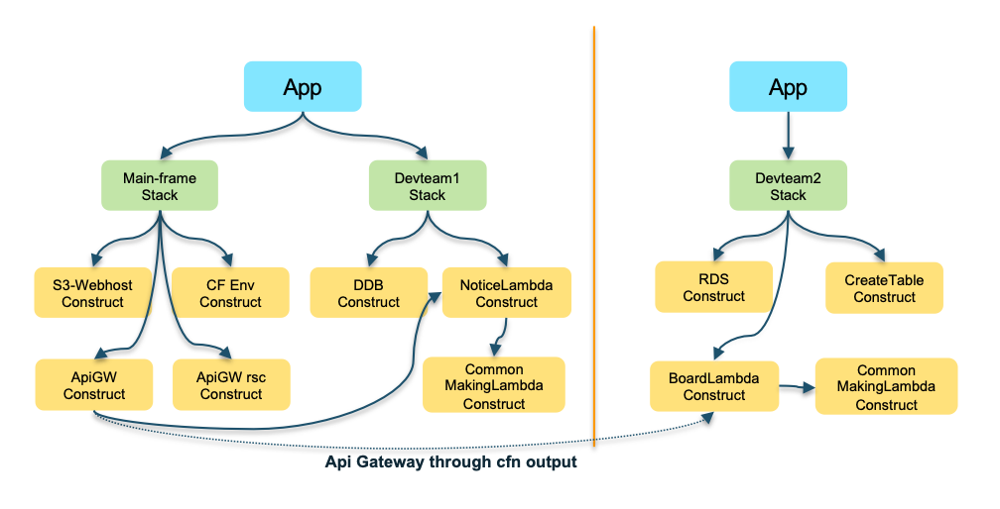

# Multi pipeline Serverless Web Application with AWS CDK
This project allows you to build a serverless web application with multiple pipelines managed separately by your infrastructure and development teams.
By provisioning this project, you can see and experience whether a serverless architecture will behave the same as a traditional architecture.
You can also learn about the benefits of the [AWS CDK](https://aws.amazon.com/ko/cdk/) and how to use it.

## Architecture

- Serverless Architecture + Provisioned RDS, RDS Proxy

## Scenario (Overall summary)
There are three teams managing resources individually for a single service.
1. Infrastructure team managing overall infrastructure configuration including Amazon S3, Amazon CloudFront, Amazon API Gateway, etc.
2. Development team 1 using a serverless architecture using Amazon DynamoDB and AWS Lambda for API Gateway configured by the infrastructure team.
3. Development2 team using Amazon RDS and AWS Lambda for work that requires a relational database.

The configuration for a multi-pipeline structure for these three teams is shown in the image below.

## CDK Tree data structure

- The main frame is configured to have one app root for the situation where the infrastructure team and the development 1 team are configured within one CDK pipeline. However, since it has a separate stack structure, applications can be managed individually.     
The mainframe stack also includes the process of attaching a manually created lambda to API Gateway from the console and granting permissions.
- Devteam2 is configured as a separate project so that each team can manage the CDK pipeline, and can refer to things like CloudFront Construct created in the mainframe. In the case of Devteam2, although it is not a serverless architecture, it uses RDS MySQL to have a relational database due to certain circumstances.

#### Main Frame
- MainFrame Stack
	1. S3 + CloudFront : WebHosting, Custom Error Response for Vue.js routing
	2. API Gateway : REST API, CORS
	3. Lambda : Attatch a manually created lambda

- Devteam1 Stack (Notice)
	1. DynamoDB : Create table, insert initial datas
	2. Lambda : get, post, delete

#### Devteam2 Frame
- Devteam2 Stack (Board)
	1. RDS : RDS proxy, insert initial datas
	2. Lambda : get, post, delete

## What you can see through this project.
1. Serverless architecture experience
- Based on the configuration using AWS's serverless services, learn about the serverless structure and experience how it works.
- I used Vue.js for this project, but you can see how you can static web host a reactive front end similar to this.
- *Although we do provision RDS, this is for special circumstances. If you want your relational database to be serverless as well, you can also take advantage of Amazon Aurora Serverless v2.*
2. Easy infrastructure management configuration using the familiar development language Typescipt
- You can learn how to configure the IaC environment through the development language you use frequently.
- This project was written based on Typescript.
3. Ease of deploying Lambda via CDK
- By including a Lambda function and deploying it in a CDK project, you can manage Lambda creation and source together.
- If there are no changes to the Stack or Construct, and only changes to the Lambda function, you can quickly deploy with `cdk deploy --hotswap`.
4. Easy linkage between CDK stacks or existing resources
- You can refer to already created resources or resources created in other pipeline stacks and configure additional connections to those resources.
5. Separation of pipelines for infrastructure configuration management, application service configuration management
- Depending on the size and characteristics of each organization, you can refer to or apply the pipeline configuration using CDK to gain insight into pipeline management.

## Deployment time
- Main-Frame : ~ 10 min.
- Devteam2-Frame : ~ 15min. 

## Pre Requisite
1. [Create AWS Account and Create User](https://aws.amazon.com/en/resources/create-account/)
- In order for the CDK to work, the user must have the authority to the services included in the CDK. However, you can grant administrator privileges for convenience, but it should be avoided in the operating environment.
2. [Overall installation process](https://aws.amazon.com/en/getting-started/guides/setup-cdk/)
- Contains detailed information about local or cloud9, CLI, node, CDK Bootstrap
3. AWS CLI - Version : aws-cli/2.7.14 Python/3.9.11 Darwin/20.6.0 exe/x86_64 prompt/off
4. node: v16.16
5. cdk 2.33.0 (build 859272d)
6. Docker Install
7. CDK Bootstrap
8. [SAM Install](https://docs.aws.amazon.com/en_us/serverless-application-model/latest/developerguide/serverless-sam-cli-install-mac.html)

## Set up the Project
1. 프로젝트 셋업 방법

----
## Verify deployment
1. 결과 확인 내용

----
## Used AWS Services and Pricing
1. 비용

----
## Clean-up
1. 정리 방법

----
## Code Pipeline
1. Repository Reference - get credential
- https://cdkworkshop.com/20-typescript/70-advanced-topics/200-pipelines/2000-create-repo.html

### Lambda Local Test - SAM
cdk synth --no-staging > tamplate.yml

### Invoke the function FUNCTION_IDENTIFIER declared in the stack STACK_NAME
sam local invoke [OPTIONS] [STACK_NAME/FUNCTION_IDENTIFIER]

### Start all APIs declared in the AWS CDK application
sam local start-api -t ./cdk.out/CdkSamExampleStack.template.json [OPTIONS]

### Start a local endpoint that emulates AWS Lambda
sam local start-lambda -t ./cdk.out/CdkSamExampleStack.template.json [OPTIONS]

#### temp
sam local invoke -t ./cdk.out/Devteam2FrameStack.template.json boardGet

## Useful commands

* `npm run build`   compile typescript to js
* `npm run watch`   watch for changes and compile
* `npm run test`    perform the jest unit tests
* `cdk deploy`      deploy this stack to your default AWS account/region
* `cdk diff`        compare deployed stack with current state
* `cdk synth`       emits the synthesized CloudFormation template
* `cdk deploy --all --outputs-file ./cdk-outputs.json`  deploy whole stack within a project
* `cdk deploy --hotswap`    quickly deploy lambda